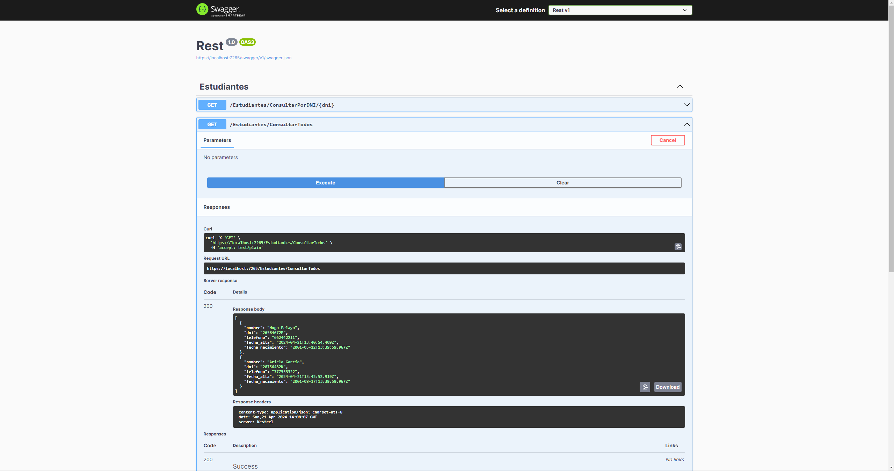

# API REST con MongoDB usando ASP.NET Core

Este repositorio contiene un ejemplo básico de una API REST utilizando ASP.NET Core y MongoDB como base de datos, desarrollado con Visual Studio y el framework .NET 8.0. Para ejecutar el proyecto, es necesario tener instalado el SDK y el runtime de .NET 8.0.

## Características

- Utiliza ASP.NET Core para crear una API RESTful.
- Conecta y opera con una base de datos MongoDB.
- Implementa operaciones CRUD (Crear, Leer, Actualizar, Eliminar) sobre recursos.
- Utiliza Visual Studio como entorno de desarrollo integrado (IDE).

## Requisitos

- SDK de .NET 8.0
- Runtime de .NET 8.0
- Visual Studio (o Visual Studio Code) con soporte para desarrollo de aplicaciones .NET Core.

## Ejecución

- Clona este repositorio en tu máquina local.
- Abre la solución en Visual Studio.
- Verifica que tengas una instancia de MongoDB en ejecución.
- Modifica la cadena de conexión a MongoDB en el archivo appsettings.json según tu configuración.
- Ejecuta la aplicación desde Visual Studio.
- Utiliza herramientas como Postman o cualquier cliente HTTP para probar los endpoints de la API.

## Licencia
Este proyecto está licenciado bajo la [Licencia MIT](LICENSE).